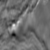

# Kaggle - TGS Salt Identification Challenge

This repository contains the code of the [Kaggle - TGS Salt Identification Challenge](https://www.kaggle.com/c/tgs-salt-identification-challenge). This competition is aimed to perform an image segmentation to detect where salt deposits are located in seismic images. The goal of the challenge is to optimize the [IoU metric](https://www.kaggle.com/c/tgs-salt-identification-challenge#evaluation) of the predicted maks.

The baseline model built consists in a [U-net](https://lmb.informatik.uni-freiburg.de/people/ronneber/u-net/) which takes a seismic image as input and outputs the predicted segmentation that indicates where the salt deposit is located.

  
  
  
  <em>Train input-output sample</em>

As the result of the competition, I have achieved an IoU value of 0.801 in the Public Leaderboard (1522/3291 position) and 0.824 in the Private Leaderboard (1479/3291 position), just 0.072 from the best solution.

## What worked

After performing a bunch of tests, in general terms, the bigger the Neural Network is, the more accurate is the prediction. But this size is limited by the hardware restrictions. 

Using **residual blocks** in the U-net layers leads to a more accurate prediction. The final prediction uses a [U-net](https://github.com/AlbertoSabater/Kaggle-Salt-Identification-Challenge/blob/master/nn_models.py#L177) built by 18 residual blocks, each of them made by 2 Convolutional layers. The model also uses BatchNormalization and Dropout to improve its performance. The NN also counts with 4 levels of MaxPooling in the encoder which are reverted with upsampling in the decoder. The padding of each Convolution layer is truncated to allow the NN to take the real input size (101 x 101 pixels) without the need of a resizing, this improves the model performance and training time.

Since the training dataset is not too big, **Image Data Augmentation** is essential to not overfit the data. This augmentation involves horizontal flip, image rotation, zoom and width and height shift.

The [loss](https://github.com/AlbertoSabater/Kaggle-Salt-Identification-Challenge/blob/master/nn_models.py#L31) used to train the model uses a combination of the **Binary Cross-Entropy** and the **Dice Coefficient**.

Due to the size of the dataset and its data distribution, a **training with the full augmented dataset** and use the full no-augmented dataset as a test set performs better than a training with train-test split.

The **threshold** used to get the final prediction is tuned to optimize the IoU metric used to evaluate the competition submission.

The final prediction is optimized by applying **Test-Time Augmentation** (TTA). With this method, each test sample is predicted several times with different Image Augmentations (horizontal flip in this case) and finally, each prediction is averaged to get a final prediction.

**Model Stacking** also improved prediction accuracy. In this way, an array of models (with the same architecture) is trained and the final prediction is averaged with all of their predictions.

To optimize the training time and performance a set of **[callbacks](https://github.com/AlbertoSabater/Kaggle-Salt-Identification-Challenge/blob/master/main.py#L227)** are added to it. 

## What didn't work

Train-test split didn't perform better on the leaderboard as a training with the full augmented dataset. Stratified train-test split (on salt coverage) and stratified k-fold have also been implemented but these techniques didn't show any improvement either.

Binary Cross Entropy loss function performed worst that the combination of BCE and Dice.

The depth of each sample has been [added](https://github.com/AlbertoSabater/Kaggle-Salt-Identification-Challenge/blob/master/nn_models.py#L73) to the Neural Network as an array concatenated to the output of several convolutional layers with no improvement of the final performance.

## To do

The use of **pretrained encoders** (ResNet18, ResNet50, etc.) has been implemented with a learning that combines a training with a frozen encoder to unfroze it for a second training. However, due to the lack of GPU memory, this training couldn't be possible.

A **bigger batch size** would also improve the model performance but it hasn't been possible either due to the GPU restrictions.

A training with the **Lovasz Loss** or a combination of it with other losses would also have been improved the model performance.

User **[Hypercolumns](https://arxiv.org/pdf/1411.5752.pdf) to get the final prediction**.
